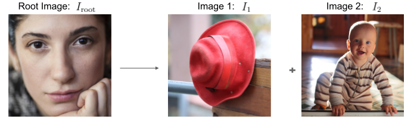

This repository is the official code of
[What makes a face looks like a hat: Decoupling low-level and high-level Visual Properties with Image Triplets](https://arxiv.org/abs/2409.02241).

This work is accepted at **Workshop on Human-Inspired Computer Vision at ECCV 2024**, Milan, Italy.
The camera-ready version is coming soon.

### Description
The goal of this project is to decorrelate low-level and high-level similarity of images.

***For example***, considering the triplet of images above, the baby (image2) is more high-level similar to the face (root). However, the hat (image1) is more low-level similar to the face.
High-level and low-level similarity are computed by FC3 and Pool3 layers in VGG16.

Please read the paper for the full details of (dis)similarity definitions and the pseudocode for generating a set of triplets.

### Pre-requisites
1. Pytorch 2.x (This is for get_corr_mat.py, you can use your own script to get correlation of model layers)

If you want to add new neural network models, you may want to compute their Brain-Score to select the most suitable layers for predicitng neural responses.

2. (Optional) Install BrainScore from https://github.com/brain-score/brain-score

3. (Optional) Install Candidate models from https://github.com/brain-score/candidate_models


### Example
1. Getting correlation matrices from the layer X of the neural network Y 
```
python get_corr_mat.py --model_name vgg-16 --selected_layer features.43 --stim_data_path ./images/ --saved_path ./corr_mat/ --filename_order_path filenames.npy
```

Note that --filename_order_path is to check whether the new correlation matrix is align with the previous image orders. If you extract correlation matrix for the first time you do not need to use this, the script will return filenames_{model_name}_{layer_name}.npy which contains the ordered images from index1 to indexN, where N is the number of images in your "images" folder.


After running "get_corr_mat.py" for 2 layers (such as features.43 and features.27 of vgg-16), it will return corr_vgg-16_features.{idx}.npy which is to fed into the triplet search script below.

2. Search for triplets
   
Here we use IT_layer as features.43 and V2_layer as features.27 of VGG-16 (No need to be IT and V2, it can be any arbitrary layers)
```
python get_triplets_parallel.py --triplet_saved_path triplet_vgg16_IT_f43_V2_f27 --upper_corr_path corr_vgg-16_features.43.npy --intermediate_corr_path corr_vgg-16_features.27.npy --num_loops 20
```


### If you use any parts of this repository, please consider cite our work.

```
Piriyajitakonkij, Maytus, Sirawaj Itthipuripat, Ian Ballard, and Ioannis Pappas.
"What makes a face looks like a hat: Decoupling low-level and high-level Visual Properties with Image Triplets."
arXiv preprint arXiv:2409.02241 (2024).
```
